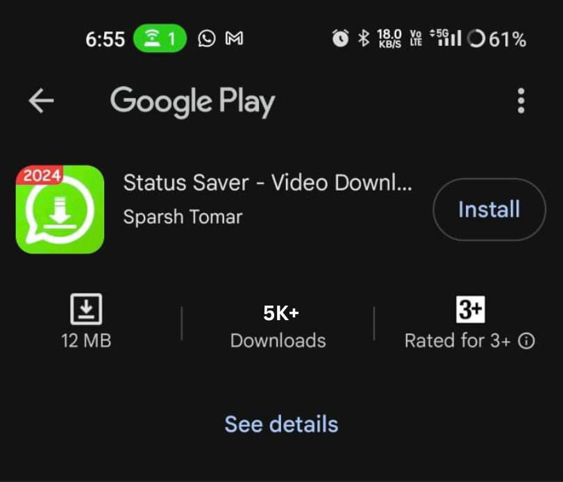
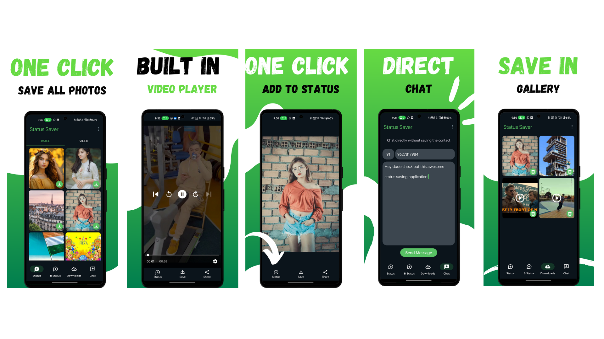

# Status Saver - Video Saver

Status Saver is a Kotlin-based Android application that allows users to save WhatsApp statuses (both images and videos) locally. It supports easy viewing, sharing, direct chat and reposting.

## 🚀 Features

- 📥 Save WhatsApp image and video statuses
- 🎞️ Video playback support
- 🔁 Repost and share functionality
- 🗂️ Easy-to-use gallery view
- 🔒 Compatible with WhatsApp and WhatsApp Business
- 🎞️ Direct Chat without saving phone number

## 🛠️ Built With

- Kotlin
- File API / MediaStore / Glide
- MVVM architecture
- Scoped storage support for Android 10+

## 📊 Play Store Performance

This app was also previously published on the Play Store and gained a large number of downloads before account termination. See below:

> 📈 **Total Downloads:** Over 5K+ downloads on the Play Store with 4.5+ rating.

## 📱 Screenshots

## 📦 Installation

1. Clone the repository
2. Open in Android Studio
3. Build and run on an Android device or emulator

## 🔐 Permissions Required

- Read External Storage
- Write External Storage (if targeting Android 10 or below)
- Manage All Files access (for Android 11+)

